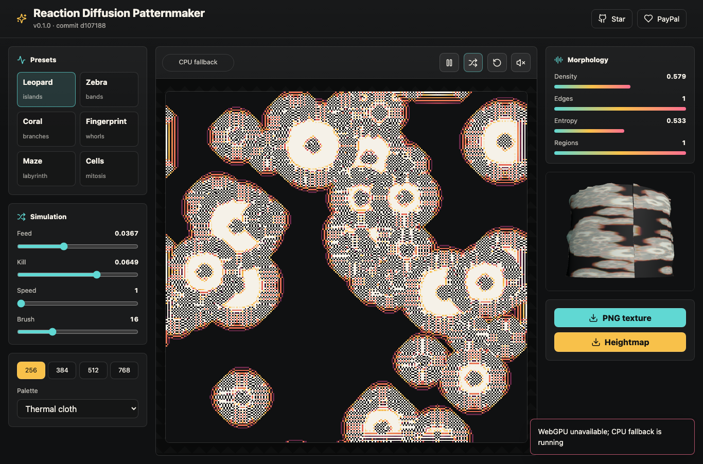
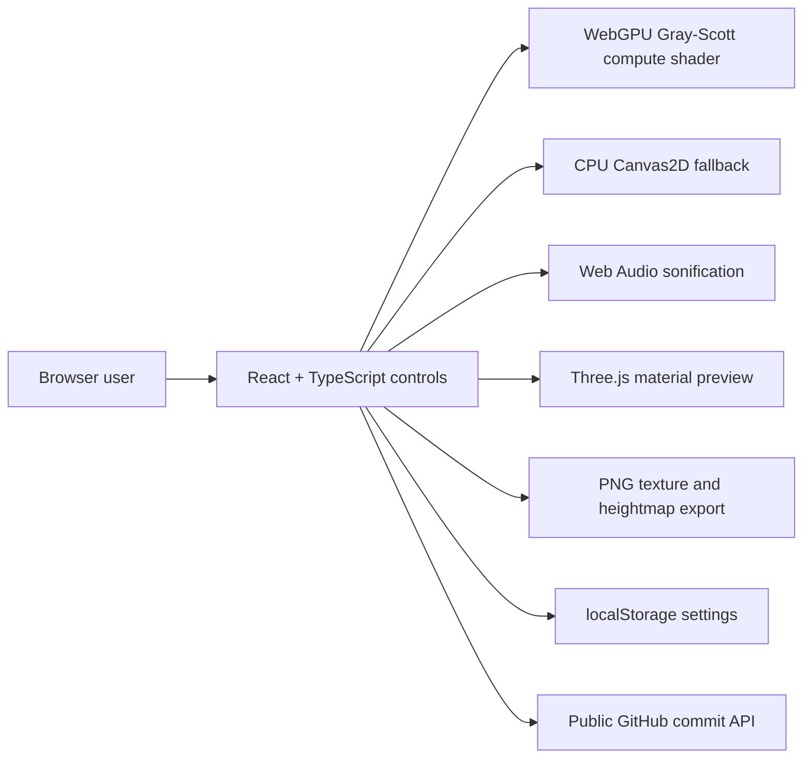

# Reaction Diffusion Patternmaker


Live site: https://baditaflorin.github.io/reaction-diffusion-patternmaker/

Repository: https://github.com/baditaflorin/reaction-diffusion-patternmaker

PayPal: https://www.paypal.com/paypalme/florinbadita

A browser lab for live Gray-Scott patterns, musical sonification, and exportable textures.



## What It Does

Reaction Diffusion Patternmaker runs Turing-style morphogenesis equations in the browser. WebGPU drives the live Gray-Scott simulation when available, CPU canvas rendering keeps unsupported browsers usable, Three.js previews the pattern as material, and Web Audio maps morphology metrics into sound.

The live page shows the current app version and latest public `main` commit, plus links back to GitHub and PayPal.

## Quickstart

```bash
npm install
make install-hooks
make dev
```

## Local Checks

```bash
make lint
make test
make build
make smoke
```

## Architecture



Deployment mode: Mode A, pure GitHub Pages. No runtime backend, no secrets, no Docker, no analytics.

Architecture docs: https://github.com/baditaflorin/reaction-diffusion-patternmaker/blob/main/docs/architecture.md

ADRs: https://github.com/baditaflorin/reaction-diffusion-patternmaker/tree/main/docs/adr

Data contract: https://github.com/baditaflorin/reaction-diffusion-patternmaker/blob/main/docs/data.md

Privacy: https://github.com/baditaflorin/reaction-diffusion-patternmaker/blob/main/docs/privacy.md

Deploy guide: https://github.com/baditaflorin/reaction-diffusion-patternmaker/blob/main/docs/deploy.md
