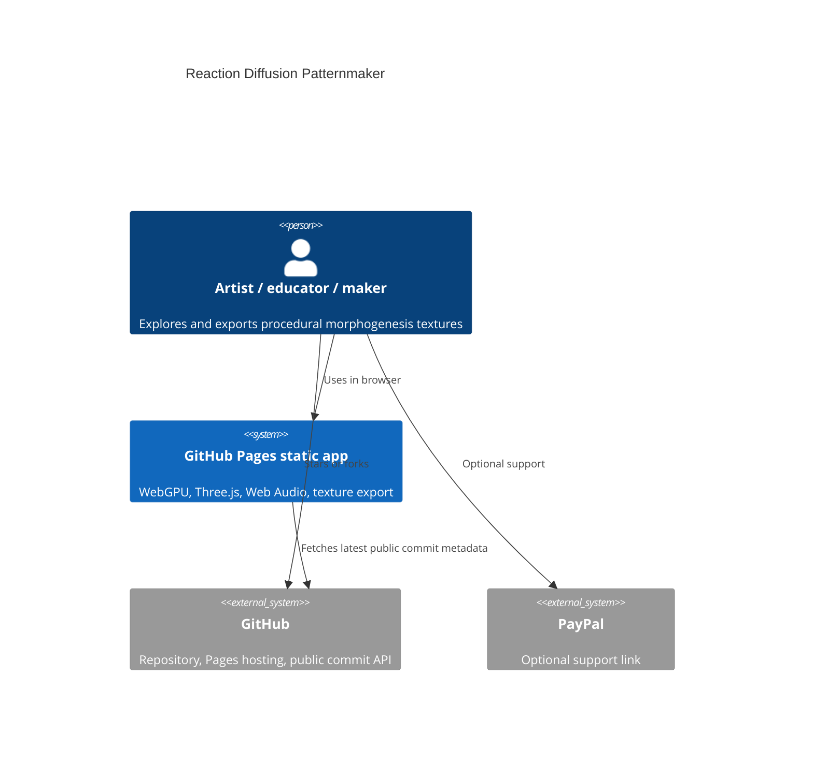
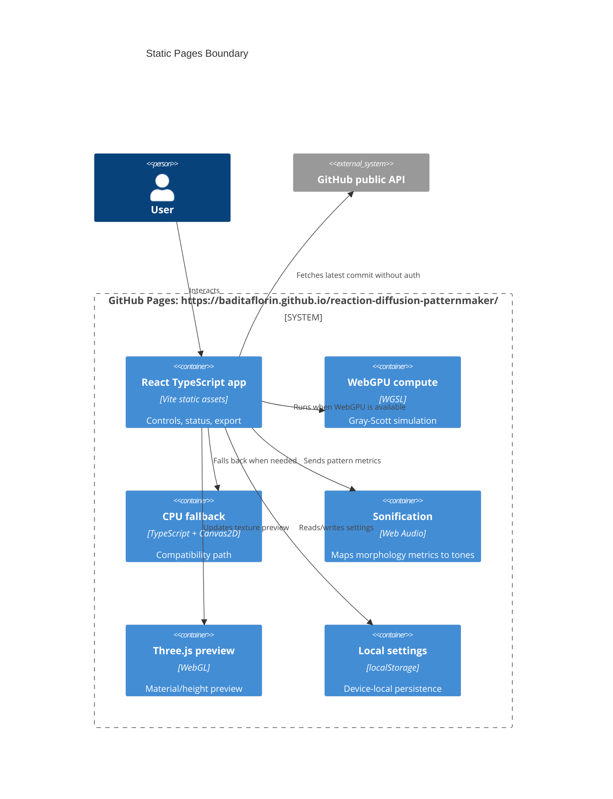

# Architecture

Live site: https://baditaflorin.github.io/reaction-diffusion-patternmaker/

Repository: https://github.com/baditaflorin/reaction-diffusion-patternmaker

## Context

```mermaid
C4Context
  title Reaction Diffusion Patternmaker
  Person(user, "Artist / educator / maker", "Explores and exports procedural morphogenesis textures")
  System(app, "GitHub Pages static app", "WebGPU, Three.js, Web Audio, texture export")
  System_Ext(github, "GitHub", "Repository, Pages hosting, public commit API")
  System_Ext(paypal, "PayPal", "Optional support link")
  Rel(user, app, "Uses in browser")
  Rel(app, github, "Fetches latest public commit metadata")
  Rel(user, github, "Stars or forks")
  Rel(user, paypal, "Optional support")
```

## Container

```mermaid
C4Container
  title Static Pages Boundary
  Person(user, "User")
  System_Boundary(pages, "GitHub Pages: https://baditaflorin.github.io/reaction-diffusion-patternmaker/") {
    Container(ui, "React TypeScript app", "Vite static assets", "Controls, status, export")
    Container(shader, "WebGPU compute", "WGSL", "Gray-Scott simulation")
    Container(cpu, "CPU fallback", "TypeScript + Canvas2D", "Compatibility path")
    Container(audio, "Sonification", "Web Audio", "Maps morphology metrics to tones")
    Container(preview, "Three.js preview", "WebGL", "Material/height preview")
    Container(storage, "Local settings", "localStorage", "Device-local persistence")
  }
  System_Ext(github, "GitHub public API")
  Rel(user, ui, "Interacts")
  Rel(ui, shader, "Runs when WebGPU is available")
  Rel(ui, cpu, "Falls back when needed")
  Rel(ui, audio, "Sends pattern metrics")
  Rel(ui, preview, "Updates texture preview")
  Rel(ui, storage, "Reads/writes settings")
  Rel(ui, github, "Fetches latest commit without auth")
```
